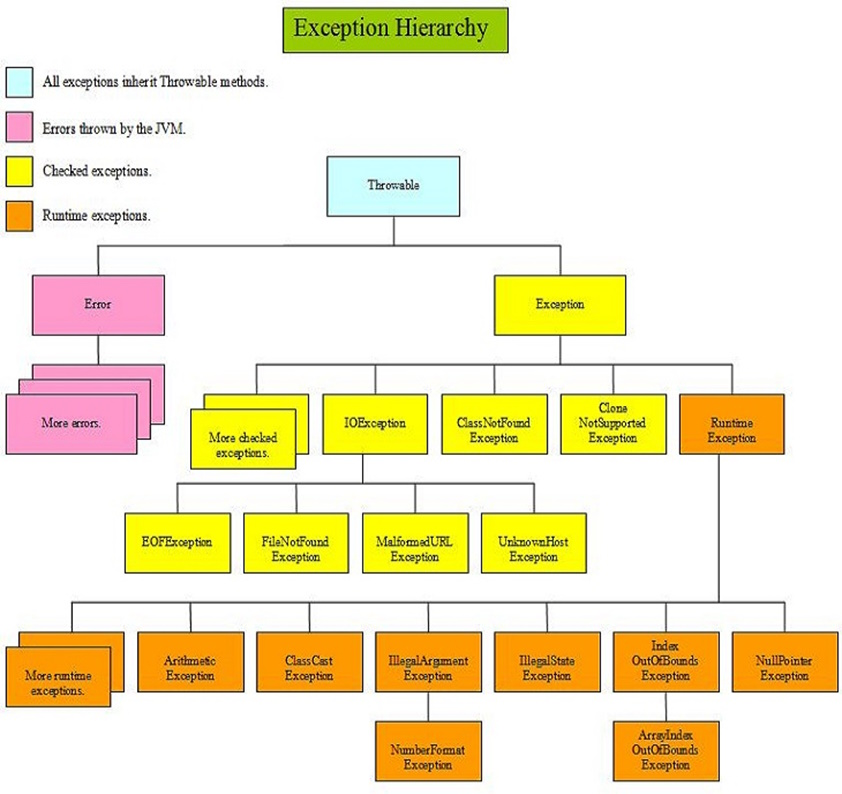

# 4 Supporf of testing - exceptions, unit testing

## Exceptions

Exceptions are one of the basic error representation mechanisms in typical object-oriented programming languages. They are raised during code evaluation as a reaction to an unexpected or erroneous state. They can be handled by a programmer. If not, they cause an application crash.


The issue of exceptions in general (including exceptions in the Java language) is generally more complex. The following chapter does not have the task of presenting the full issue of exception management, but only the necessary basics sufficient to catch the error and then diagnose the problem. For more information about exceptions and how they are handled, see, for example, [http://docs.oracle.com/javase/tutorial/essential/exceptions/](http://docs.oracle.com/javase/tutorial/essential/exceptions/).


Errors may occur during certain types of operations. Operations are represented by methods, so there is a situation where the execution of the method fails and ends with an error. If the programmer anticipates an error (or in the Java language, the method informs him of the possible occurrence of the error himself), he can/is forced to treat the given method, or block of methods, with the technique of exception handling so that he is able to react to the given error and perform any corrective operations in the event of its occurrence occurrence.

### Basic exception handling

The basis of error handling is the use of the try-catch-finally technique. This technique is based on the existence of three blocks in the code:

* A block introduced by the try keyword represents a command or a sequence of commands that can cause an error to occur. There must always be exactly one try block in the try-catch-finally sequence.
* A block preceded by the catch keyword is used to represent the code to be executed in the event of an error. This code is only executed if an error occurs. This block can be repeated and define different behavior for different types of errors. In a try-catch-finally sequence, the catch block does not need to occur if there is a finally block. However, if the finally block is not present, there must be at least one catch block.
* The block introduced by the finally keyword is used to define code that is always executed, whether an error occurs or not. The finally block is optional.

A short example follows. Consider the following code:

```java
String retezec = "Hello";
Double cislo = Double.parseDouble(retezec); 
```

It is obvious from the code that it cannot run because the string "Hello" certainly cannot be converted to a number. If we were to run the application directly like this, it would end up running with an unmanaged error and crash (which the developer doesn't want):

```
run:
Exception in thread "main" java.lang.NumberFormatException: For input string: "Hello"
	at sun.misc.FloatingDecimal.readJavaFormatString(FloatingDecimal.java:1241)
	at java.lang.Double.parseDouble(Double.java:540)
	at trycatchfinally.TryCatchFinally.main(TryCatchFinally.java:21)
Java Result: 1
BUILD SUCCESSFUL (total time: 1 second)

```

The programmer must therefore treat the given function and prepare for the occurrence of an error. The basis is to enclose potentially error commands in try blocks and connect the catch block:

```java
try{
  String retezec = "ahoj";
  Double cislo = Double.parseDouble(retezec);      
} catch (Exception ex) {
  // here will be the exception handling
  // will be explained later
} 
```

In order for the user to have some output even in retrospect, whether the given code was executed successfully, we can inform him by a statement on the console:

```java
try{
  String retezec = "ahoj";
  Double cislo = Double.parseDouble(retezec);
  
  System.out.println("Převedení se povedlo");
  
} catch (Exception ex) {  
  System.out.println("Převedení se nepovedlo");  
} 
```


Note that printing an information message to the console to see how the try-catch block behaved is **a very bad practice**. In general, there is no certainty where the output will be printed in the final application and if anyone can see it. Therefore, we mention this technique here only for demonstration purposes.


Alternatively, the functionality will normally be called in a function. A `try-catch-finally` block can be used to ensure that if the function succeeds, it returns the converted value, otherwise it returns some "special" value, such as not-a-number, `NaN`:

```java
public double stringToDouble(String input){
  double ret;  
  try{
    ret = Double.parseDouble(input);
  } catch (Exception ex) {
    ret = Double.NaN;
  }  
  return ret;
} 

```

Všechny uvedené výpisy mají stejný průběh:

1\. Při vykonávání se vstoupí do bloku _try_. Program tak ví, že pokud něco selže, má zkusit selhání (chybu) ošetřit pomocí následujícího (případně obecně jednoho z následujících) bloku _catch_.

2\. Program se pokusí převést řetězec na číslo s využitím metody _parseDouble()_.

a. Pokud operace neselže, tedy proběhne v pořádku. Pokračuje se výpočet dalšími příkazy v bloku _try_, po jeho ukončení se skáče až za všechny odpovídající bloky _catch_, tedy buď do bloku _finally_, pokud existuje, nebo až za něj.

b. Pokud operace selže, tedy neproběhne v pořádku, metoda _parseDouble()_ vyvolá chybu. Program se pokusí nalézt vhodný blok _catch_ (co to znamená „vhodný“ bude vysvětleno dále). Pokud jej nalezne, začne vykonávat všechny příkazy v tomto bloku. Po dokončení příkazů v bloku _catch_ začne vykonávat příkazy bloku _finally_, případně skočí až za sekvenci _try-catch-finally_.

All listed statements have the same course:

1. During execution, a `try` block is entered. The program thus knows that if something fails, it should try to handle the failure (error) using the following (or generally one of the following) `catch` block(s).
2. The program tries to convert the string to a number using the `parseDouble()` method.

* If the operation **does not fail**, it is successful. The calculation is continued with other statements in the `try` block, after its termination it jumps beyond all corresponding `catch` blocks, i.e. either to the `finally` block, if it exists, or beyond it.
* If the operation **fails**, the `parseDouble()` method throws an error. The program will try to find a suitable catch block (the meaning of "suitable" is explained later). If it finds it, it starts executing all commands in that block. After completing the commands in the `catch` block, it starts executing the commands of the `finally` block, if exists.

### Catching the exception

The catch block is not simply written as catch{…}, but has a more complex notation – it looks more like a function that always has one mandatory parameter:

```java
try {
  // tested code
} catch (Exception ex) {
  // code invoked when exception occurs
} 
```


Note that in the following test, the word "Exception" has a different meaning than the word "exception". The first one refers to the "Exception" class, which is one of the classes representing errors in the code, so it refers to the class name. The word "exception" refers to a general error - an exception - invoked in the code.

We do not use the word "error" here, cos it has a slightly specific and different meaning in the Java language.


The parameter defines the type of exception (`Exception`, see below) and the variable `ex` through which you can access and find out more detailed information about the issue. In the variable `ex` there is an object - an instance of the class - describing the exception in a closer way. Its use will be explained in more detail in the next chapter. An exception from Java's point of view is nothing special, it is a regular instance of a class. The exception itself (that is, the object representing the error) is an instance of some class. The data type of this class is typically Exception, the variable into which the object is inserted is the already mentioned ex. The above example `... } catch (Exception ex) { ...` says "catch an exception of type Exception into the variable ex".


Typically, the variable in `catch`block is called `e`or `ex`. We will follow this common usage in this text. However, the name can be any valid non-conflicting variable name .


Next, it's important to explain what the exception types are. `Exception` is the name of the class defining the basic exception type. This type represents general issue in the running program. Exception classes are arranged in an inheritance hierarchy, allowing `catch` block to handle specific type of the exception.


If you are not familiar with inheritance, just imagine that classes can be organized into the tree with parent-child relationships.


Common data types are:

* Exception – the already mentioned basic type of exception, representing common expected and unexpected program errors in the sense of program logic (division by zero, wrong number conversions, reading from a non-existent file, etc.). The block with this error will also catch all other errors ending in Exception, such as DivisionByZeroException.
* Error – specific type of errors that occur directly in the virtual machine (e.g. bad operation, but typically also lack of memory, stack overflow (for recursively called functions), etc. The block with this error will also capture all other errors ending in Error , such as StackOverflowError or OutOfMemoryError.
* Throwable – is the most general type of error. If a programmer wants to catch all possible errors that can occur in the code, he catches this type. This type will also catch the Exception error type (and any subtypes that Exception catches) as well as Error errors (and any subtypes that Error catches).
* RuntimeException – is a type of exception including general errors that the programmer does not normally expect (typically errors of the arithmetic type and various conversions). In Java, methods do not announce that they can raise this type of error - an example is the string to number conversion above.
* abcException – specific specific errors, where "abc" is replaced by a general description of the exception. There are a large number of these errors and they serve precisely to specify the type of error and the method of treating the error that follows.

In a very simplified way, the hierarchy of exceptions is shown in the figure.



To demonstrate, we need a more complex example - let's consider reading from a file:

```java
java.io.FileReader rdr;
try {
  
  rdr = new java.io.FileReader("C:\\test.txt");
  int data = rdr.read();
  
} catch (FileNotFoundException ex) {
  System.out.println("The file was not found.");
} catch (IOException ex) {
  System.out.println("Error reading the file.");
} 
```

With this variant, two branches of catch blocks were created:

* The first branch catches an exception of the FileNotFoundException type, which occurs if the specified file does not exist. The application can respond to this type of error, for example, by prompting the user to enter another file or to check the inserted media.
* The second branch catches an exception of the IOException type, which occurs in the case of working with a file, i.e. if, for example, it will not be possible to read from the file for some reason.&#x20;

So, the programmer can choose how to handle these two errors. In addition, a third catch block can be added to the code to catch other potential errors that may arise, for example as follows:

```java
java.io.FileReader rdr;
try {
  
  rdr = new java.io.FileReader("C:\\test.txt");
  int data = rdr.read();
  
} catch (FileNotFoundException ex) {
  System.out.println("The file was not found.");
} catch (IOException ex) {
  System.out.println("Error reading the file.");
} catch (Exception ex) {
  System.out.println("Some generic exception occured.");
} catch (Error ex) {
  System.out.println("Internal Java Virtual Machine error occured.");
} 
```

A final note - repeating `catch` blocks can cause a certain type of error to be caught by more than one catch block - **the order of the `catch` blocks matters**. The first matching `catch` block will be used.

### Getting more detailed info about the cought exception

As mentioned, for each `catch` block, the data type of the exception is mentioned in parentheses and a variable attached to it (typically called `ex`) that contains an object with information about the error that occurred.

```java
...
} catch (Exception ex) {
...
```

We will not describe the `ex` object and its abilities in detail, we will focus only on basic operations. The base method of the `ex` object is the `getMessage()` method, which returns text information about the error. If we modify the above example to state:

```java
try {
  String retezec = "Hello";
  Double cislo = Double.parseDouble(retezec);
  
  System.out.println("Conversion successful");
  
} catch (Exception ex) {
  
  System.out.println("Conversion failed: " + 
          ex.getMessage());  
} 
```

..., the output will be:

```
Conversion failed: For input string: "Hello"
```

It's a bit more specific information than a general message, and you can immediately tell that the conversion failed because the input for the conversion was the input string "hello".&#x20;

Typically, the type (= class) of error is also important information - sometimes even the type of error is important to understand what is actually wrong. The following code performs (some unspecified) operation and includes catching an error and printing a message:

```java
try{
  
  Class.forName("eng.some.class");
  
} catch (Exception ex){
  System.out.println(ex.getMessage());
} 
```

```
eng.some.class
```

This information explains anything. We need to extend the code to get the type information too:

```java
try{
  
  Class.forName("eng.some.class");
  
} catch (Exception ex){
  System.out.println(ex.getClass().getName());
  System.out.println(ex.getMessage());
} 
```

Now, we will get more specific output:

```
java.lang.ClassNotFoundException
eng.some.class
```

This output tells us that the the class (`eng.some.class`) was not found (`ClassNotFoundException`).

### Exception chaining

Another important point is exception chaining. The application is mostly built in layers, as shown in the following figure. Consider an example where the application stores data entered by the user in a database.

!\[Application layers)(Imgs/4-layers.jpg)

A higher layer always asks a lower layer to perform an action. Of course, if an error occurs on a lower layer, the error will flow to the higher layer in the same, gradual way. However, the exception does not have to remain the same - higher layer receiving the exception from a lower layer can augment the exception with some additional information specifying the error more closely, as shown in the next figure.

!\[Application layers - chained exceptions]\(Imgs/4-layers-exceptions.jpg)

As you can see, the layer at each level has its own information that it can provide to the error:

* The lowest layer may say that the SQL operation failed because the database server refused to store a value in some column.
* A higher layer can add that the save failed for a specific table.
* The upper layer reports that an error occurred while working with the database.
* An even higher layer will report that, in general, the user's save action failed.&#x20;

The separate information of each layer is insufficient to diagnose the error, but by putting the information together, an accurate picture of the problem can be obtained.&#x20;

So what about exceptions? Above the `ex` object, an internal error (submerged, chained) can be obtained by calling the `getCause()` method:&#x20;

* If this method returns null, there is no nested exception.
* If this method returns an object (an instance of the `Throwable` class, see exception types above), this is nested information. The `getMessage()` method can of course be called above the nested object, and it is possible to check whether another exception is not nested in the nested exception with the `getCause()` method.&#x20;

A loop to allow deep exception traversal with a step-by-step listing would look like this:

```java
try{  
  // throws an error
  throw x;
  
} catch (Exception ex){
  
  // take an exception into variable 't'
  Throwable t = ex; 
  
  // while 't' is not null (= empty)
  while (t != null){
    
    // print current 't' message
    // optionally, you can print the class here too (see above)
    System.out.println(t.getMessage());
    
    // try to obtain a nested (chained) exception)
    // if there is not nested exception, null is returned
    t = t.getCause();       
  }  
} 
```

For the image example above, the output listing should look like this (an exception per line):

```
User saving failed.
Database operation failed.
Error when accessing table "User".
SQL failed: invalid value for column "Password".
```


