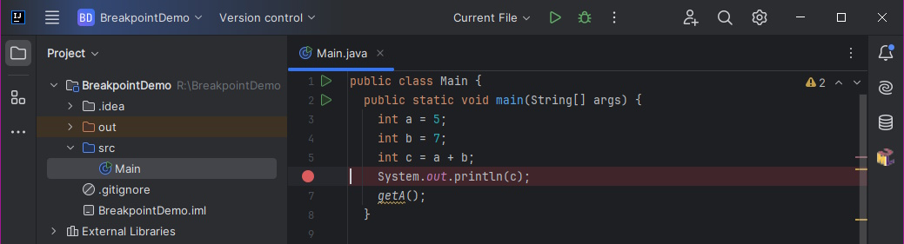
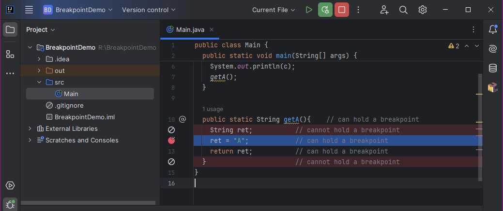
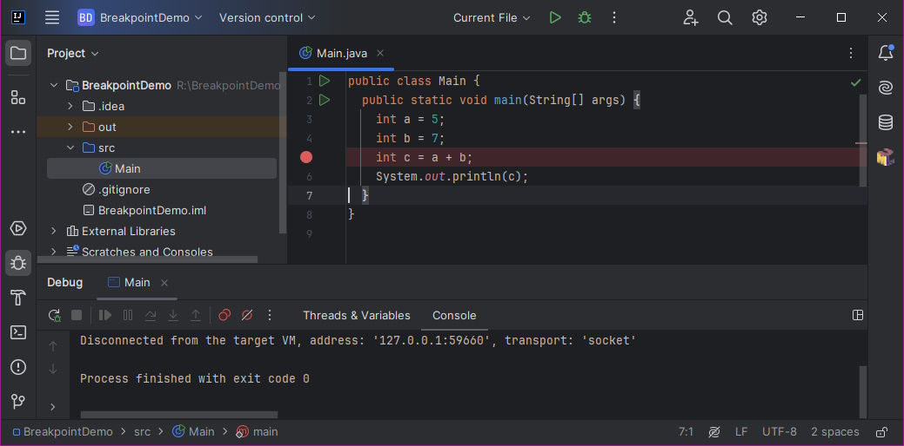
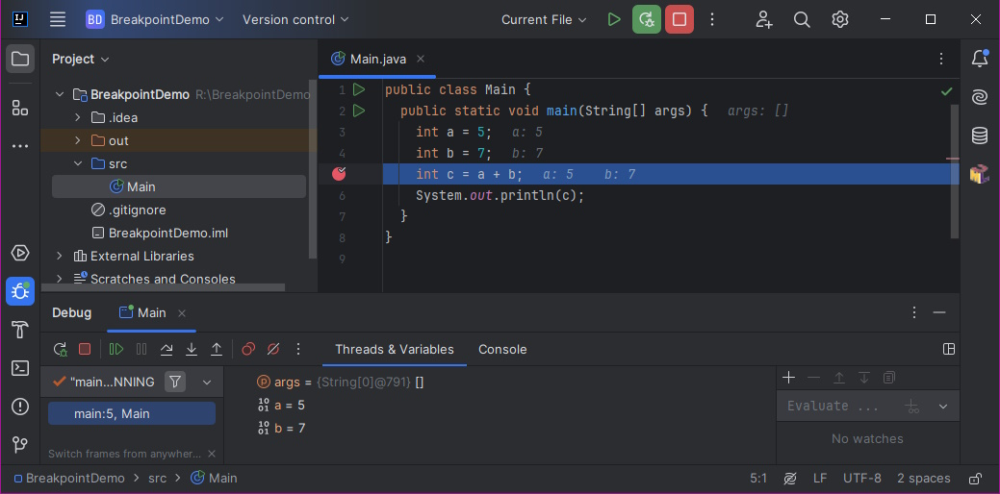
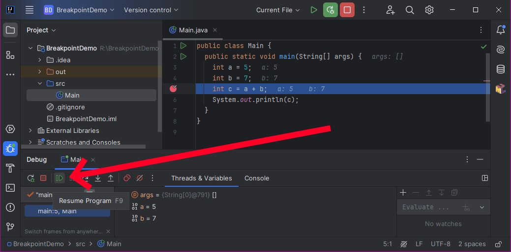
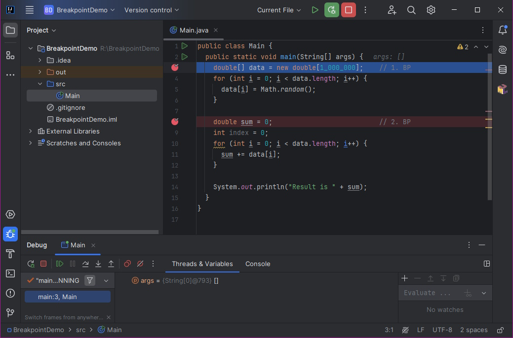
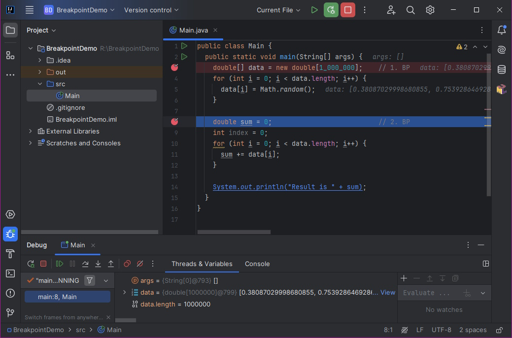

# 5 Breakpoints

**A breakpoint** is a program interruption point. Its goal is to interrupt the program at a specific point. So if we place a breakpoint somewhere in the source code of the program, the application will stop juste before executing this command.

An important note is that a breakpoint can only be placed on a statement. For example, variable declarations are not statements (they only say that a variable will exist, but the program does not perform any "operation" regarding this code. On the other side, if a value assignment is a part of variable declaration, it is already a valid statement (the operation is "assigning a value to a variable").

```java
int a; // not a statement

int b = 0; // is a statement
```

Similarly, method declarations/headers are not statements. However, the body of methods typically contains commands:

```java
public String getA(){	// not a statement, but a breakpoint can be placed here
  String ret;         	// not a statement
  ret = "A";        	// is a statement
  return ret;         	// is a statement
}         		// not a statement
```

Note that although the method signature line is not a statement, you can place a breakpoint here. Once set, the environment will automatically place a breakpoint on the first statement line of the method.


A special case is the closing bracket of the "}" block of a method. It is not a statement, but in some development tools, the breakpoint can be placed here so that the programmer can catch the exiting of the method - so it is an auxiliary tool for the programmer.


## Basic Breakpoint Operations

A breakpoint can be placed in two simple ways:

* Ctrl+F8 on a specific line
* By clicking on the desired line in the line header before the line number (gray column).


Note that the exact keyboard shorcuts can be changed. Always refer to your Idea settings to check for the correct keyboard shortcut.




The purple circle shows where to click to insert a breakpoint. Insertion of a breakpoint is reflected by coloring the line with a reddish color and a circle icon of the same color. The following figure shows the insertion of a breakpoint on all command lines.



In the figure, you can notice:

* At line 10 - It was mentioned above that a breakpoint cannot be placed on a method declaration. However, Idea allows you to prepare a breakpoint here. At startup, the breakpoint is not placed here, but placed at the first statement of the method and the run is interrupted once the method is called. This state is represented by a change in icon - a reddish diamond  (instead of a circle).&#x20;
* At line 11 - As mentioned, a variable declaration is not a statement. Therefore, you cannot set the breakpoint here. Or, more precisely - you can set a breakpoint here; however, once executed, the invalid breakpoints are ignored and represented by the respective icon (see lines 11 or 14).
* At line 14 - You cannot defined a breakpoint at the method end. To do so, you need to place a breakpoint at the `return` statement.

Removing a breakpoint is done in the same way as adding one.&#x20;

A demonstration of behavior follows. Let's have the following simple code in the main() method.

```java
public static void main(String[] args) { 
  int a = 5;  
  int b = 7;  
  int c = a + b;  
  System.out.println(c);  
} 
```

The method adds two numbers and prints the result. We place a breakpoint on the addition line.



Now let's run the application.

If we start the application classically – F6 – without debug mode, the application will run to the end, it will terminate and the sum statement obtained by line 13 – i.e. the value 12 – will appear on the console.

However, if we start the application in debug mode - Ctrl+F5, the application will start in _DebugRun_ mode and then gets interrupted in _Stepping_ mode (see next chapter) on line 12 after reaching the breakpoint. This will be signaled by a green colored line:

TODO 5-example-run.jpg


The blue-colored line says that the application is in a suspended state, in stepping debugging mode. The highlighted line indicates a command that is yet to be executed.

In the stepping mode, you can dynamically add or remove additional breakpoints to the application: just place (or remove) them again.

To resume the application run from suspended mode, use F9 key or the green arrow in the _Debug_ toolbar




Do not use the common _Run_ or _Debug-Run_ commands from the toolbar. Those commands will try to start another instance of your application. Once the application is started in the _Debug-Run_ mode, all related stuff is available using the _Debug_ window, typically located at the bottom of the screen.


Another example.

If we place two breakpoints in the program, the application will stop when the first one is reached. Consider a program that generates an array of numbers and then sums them. Finally it prints the result.

```java
public static void main(String[] args) {
 
  double [] data = new double[1_000_000]; 		// 1. BP
  for (int i = 0; i < data.length; i++) {
    data[i] = Math.random();
  }
  
  double sum = 0;   					// 2. BP
  int index = 0;
  for (int i = 0; i < data.length; i++) {
    sum += data[i];
  }
  
  System.out.println("Result is " + sum);
} 
```

Place two breakpoints in the program and then start the program. The program first stops at the first breakpoint.



If the programmer now wants to continue the calculation, he presses the F9 key and the program runs until it hits the second breakpoint:



If the programmer now starts the program again, the program will reach the end (because there is no more breakpoint in the run path) and will exit.

General rules using breakpoints for transitions between debug-run and stepping states can be subsequently formulated as follows. If the programmer starts a program in debug-run mode, the program will run in this mode until:

* does not end (by successfully completing the program);
* there is no fatal error in the application terminating the running of the application (unsuccessful termination of the program);
* does not encounter a breakpoint (switches to the stepping state).

## Using a breakpoint to monitor the application's progress


