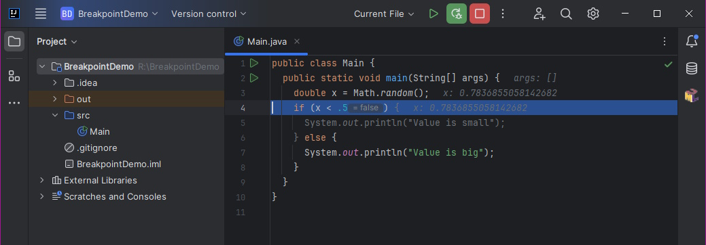

# 6 Stepping

Stepping allows you to go through the program not all at once, but gradually, by individual commands, as they will be processed one after the other in the program. Stepping takes into account the order of commands, so it can track, for example, jumps within an if statement, repetition of statements in a for loop or bounces in switch statements, as well as, of course, following other statements when jumping into the body of methods when they are called.

Let's have a simple program (don't follow the individual commands, it's not about what they do, but that they are executed).

```java
java.util.Date dt = new java.util.Date();
java.text.SimpleDateFormat sdf = 
        new java.text.SimpleDateFormat("dd. MMMM yyyy");
String line = sdf.format(dt);
System.out.println("Today is " + line); 
```

When running, the entire program starts, executes, and we receive the result. However, if we step it, we can go through the commands one by one. As you step, the development environment displays the command that will be executed next. In Idea, for example, the selected line has a blue background. Thus, if the application is stepped step by step, we get:


Three basic types of steps will be introduced:

* Step in (F7) – performs a step into the command; if the statement is a method call, steps inside the method; otherwise, it executes the classic command and continues to the next one;
* Step over (F8) – performs a step over the command; if the statement is a method call, it calls it, executes it, waits for it to complete and return a result, and continues to the next statement; otherwise executes the current command and continues to the next one;
* Step out (Ctrl +F7) – performs a step "out" of the method; i.e., the rest of the current method is executed, the value from the method is returned (if the method returns a value), and it jumps out to the next statement of the parent method.


The action "step-over" something or "step-out-of" something is mentioned several times in this capter. It is importat to stress here that it does not mean, that the code is skipped. When stepped-over, the code gets calculated and evaluated like in the normal run, you just skip steps over such code.


They differ from each other in behavior. The following images show different stepping behavior. The statement framed in green is to be executed next. The arrows show where the execution will move when the desired step is taken.

* Step-into is blue.
* Step-over is orange.
* Step-out is red.


Before more brief explanation, note that all the steps can be accessed via menu Run -> Debug Actions -> ... or via keyboard shortcuts. Moreover, the most common steps are available as icons in the debug mode.


## Step-Into

The basic step is _step-into_ (sometimes also called _step-in_). This step on a regular statement causes the statement to execute and move to the next statement. However, in the case of a function call, it causes a step inside, into the function code. In NetBeans, this step is performed with the F7 keyboard shortcut.

This is the basic step to start a program in stepping mode, because starting an application is actually a call to the `main()` method. "Step-into" will step into the `main()` method on the first statement. The next call to the regular commands steps through the program step by step. Commands are executed in the order in which they follow each other. In the case of more complex program constructions (like `if`, `for`, `switch`, ...), it is followed by the command that would follow in the execution of the program.




In the example above, the first image shows the situation before execution of `if` condition - line 4. If the value of `x` is 0.7 and we apply _step-in_ to get to the next statement, we will skip to line 7. Line 5 is skipped as it is not evaluated due to false condition, line 6 is skipped as it contains no statement.


Note here that the stepping over statements holds the same rules as was presented in section about placing the breakpoints.


An interesting feature of the "step-in" step is the behavior on the function call statements. That's when a step-in is performed inside, into the code of the function. If the currently executing program is stopped at a statement by the method caller, the next execution of the step moves the code inside the function to the first statement of the function. If a simple function call:

```java
public static void main(String[] args) {   
  java.util.Date dt = new java.util.Date();  
  String line = convertDateToString(dt);  
  System.out.println("Today is " + line);  
}

private static String convertDateToString(Date dt) {
      java.text.SimpleDateFormat sdf = 
          new java.text.SimpleDateFormat("dd. MMMM yyyy");      
      String ret;      
      ret = sdf.format(dt);      
      return ret;
} 
```

Let's suspend the run at line 6 (e.g. using the breakpoint):


Now, lets make a single _step-into_:


The original line will remain colored dark red. This highlighting indicates that a function call has occurred on that line and the code is somewhere inside the called function. There can be more such tags in the code, depending on how many function calls have been made.

Whenever a function call is encountered during step-in, a step is performed inside the executed function. In the above example, the immediately following step will be interesting - the constructor call is of course also considered as a function call and therefore step-in performs a step inside the constructor with one parameter.

The peculiarity, however, is that by gradually stepping inside the functions, you can get to the case where the programmer steps into a function that he did not create himself, but uses an already created functionality from an existing library. At the same time, it is indifferent whether this library was supplied by another programmer-friend, or whether this library is the core library of the Java language and the Java Runtime Environment.

If the programmer steps inside the function in the above example, he jumps to the constructor code with one parameter of the SimpleDateFormat class, which is a class belonging to the java.text package and which is part of the core Java libraries.

However, the situation is a bit more complicated. Because a programmer typically doesn't want to step through the source code of a foreign library (especially with the code of native Java libraries, we typically don't expect them to have a bug), Idea has a setting that allows selected packages to be skipped when stepping. The setting that affects whether functionalities will be skipped during stepping can be found in the menu File -> Settings, and in the open settings window in the left tree we can find Build, Execution, Deplyment -> Debugger -> Stepping. On this page we can find and freely modify the behavior when stepping. We will set the imported packages using the "Do not step into the classes" option.


In general, following cases can occur:

* The programmer does not have the source codes for the given library available - then method stepping is not performed, the method call is evaluated and the result is immediately returned, as if stepping "into" the methods was not performed (but the method itself is of course executed and evaluated).
* The programmer has available the source codes for the given libraries, but they are marked as not to be stepped - then the system behaves the same as in the previous point.
* The programmer has the source codes for the given library at his disposal, and they should be stepped - then the classic step of the method is done. The source codes for the library can be obtained by the programmer either from the author or, in the case of JRE libraries, can be installed as an optional component within the Java SDK installation.


If a programmer steps into foreign code, you can see a slightly different tab color as the file is opened in the read-only mode and cannot be edited (however, you can add another breakpoints here). Diving into extraneous functions can be repeated.&#x20;


If you would like to do a _step-into_ a code, which will normaly be skipped, use _**force-step-into**_ feature. This will bring you into the called method even if _step-into_ will skip such method. The option is available via menu Run -> Debugging actions -> Force step into.


If we step into the constructor of `SimpleDateFormat` class, another _step-into_ request will not invoke the step, but will raise a new highlighting:


This means, that there are multiple statements at the line and Idea can step into two different locations. This feature is called _**smart-step-into**_. A programmer then may choose:

* `this(...)` - means the _step-into_ will lead into another constructor, or
* `Locale.getDefault(...)` - means the _step-into_ will enter the `getDefault(...)` function of `Locale` class.

By clicking on the selected bold text - i.e. either the `this()` constructor or the `getDefault()` method - the programmer can choose which of the methods he wants to _step-into_. By highlighting, the environment indicates to which of the calls the step will be executed. By choosing:

1. `this(…)` evaluates all parameters (including the `getDefault(...)` function) and performs an "up" step to the constructor function;
2. `getDefault(…)` steps directly into the `getDefault(…)` function, and when completed, a step into the `this(…)` constructor function is performed.&#x20;

Finally, some notes w.r.t. the inheritance, overriding and overloading:&#x20;

* _Step-into_ distinguishes method overloading and during stepping it goes with the code of the method that "matched" the parameters and will be executed. The same holds for overloaded constructors.
* _Step-into_ recognizes interfaces or class ancestors from implementations and correctly handles overriding. If we have an abstract class and its implementation, and we create a variable typed as an abstract class with value of its implementation (see the next example), stepping will correctly enter the code of the implementation and not the code of the abstract class.

```javascript
public class Demo {

  public void main() {
    A x = new B();
    x.m(); // where to step-in? A.m() or B.m()?
  }
}

class A {
  public void m() {
    // not entered here, as "x" contains an instance of "B"
  }
}

class B extends A {
  @Override
  public void m() {
    // entered here, as "x" contains an instance of "B"
  }
} 

```

* With a recursive call, the called lines are visually repeated again and again. Visually, it is not easy to distinguish how many times a certain line/function has been called. We have a _stack-trace_ tool for this, introduced later in a different section.
* Since the program is started by calling the `main()` function, executing the _step-into_ statement is the only step that allows the program to start executing, by stepping into the `main()` function.

## Step-Out

The second basic step is the _step-out_, and in meaning it is actually the opposite of the _step-in_. _Step-out_ takes a step out of a current function and stops program execution at the first statement after the exited function. If _step-out_ is called in the middle of a function, all remaining statements are executed. Thus, calling _step-out_ does not mean that the remaining statements are skipped. All commands are executed correctly.

From the point of view of a breakpoint, _step-out_ can be imagined as a step where a breakpoint is placed after the command calling the current function and the application is started in run mode - the remainder of the currently executed function is completed and the program stops at the breakpoint.

The default keyboard shortcut in the Idea environment is Ctrl+F8.

The use is obvious from the definition - we use _step-out_ if we get too deep when diving with _step-in_/breakpoints and want to move up the hierarchy in the sequence of calling functions.

Calling _step-out_ in the `main()` method completes the calculation and terminates the program.

A specific variant in Idea is step-_**out-of-code-block**_. It is useful in situations, when you are in the middle of iteration (`for`, `while`). By using _step-out_ you will get out of the method, but you only wants to get out of the iteration. The option is available via Run -> Debugging Actions -> Step Out of Code Block menu.


## Step-Over

The third basic type of step is _step-over_. This step is similar to the _step-into_, but the function steps over. Again, the code of the stepped-over function is calculated and evaluated. So if the programmer on a particular line has a function call:&#x20;

* If he wants to enter the function, he chooses _step-into._&#x20;
* If he does not want to enter the function and wants to continue stepping through the application at the same level he is currently at, he chooses _step-over_.


If you make a _step-over_ over a function containing a breakpoint inside, you will get suspended if the breakpoint is hit. To _step-over_ and ingore all breapoints inside, use _force-step-over_. This feature will force the code to the next statement, ignored all possible breakpoints hit through the run. To invoke this feature, use menu Run -> Debugging actions -> Force step over.


## Run-to-cursor

Another important feature is _run-to-cursor_. As the name suggest, the point is to place a cursor at a specific line and by invoking _run-to-cursor_, suspend the run at this statement. You can invoke this behavior using menu Run -> Debugging actions -> Run to cursor, or by a keyboard shortcut Alt+F9 by default.

Note that if you place a cursor on a non-statement line, the run will not be suspended (again, see the correct breakpoint placement explanation).


Another important feature here is _Reset Frame_. However, this one will be explained in the chapter related to the _Call stack_.

