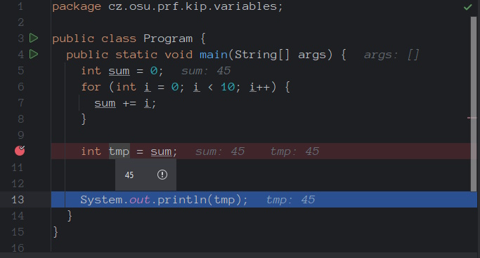
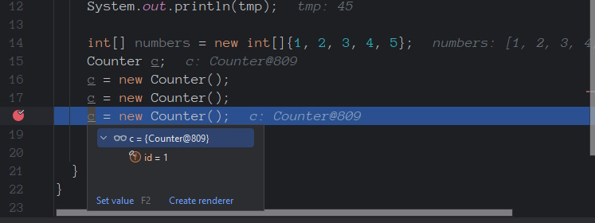
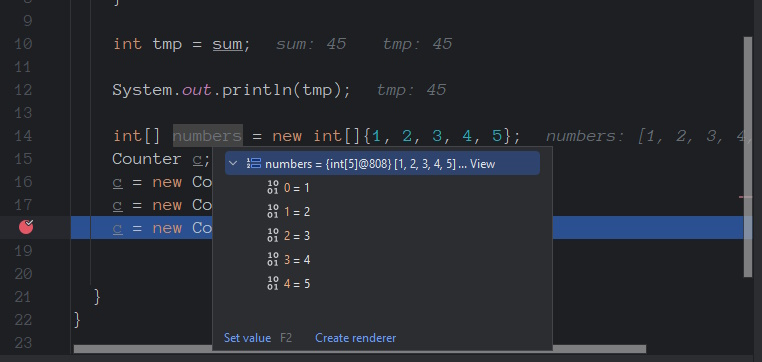
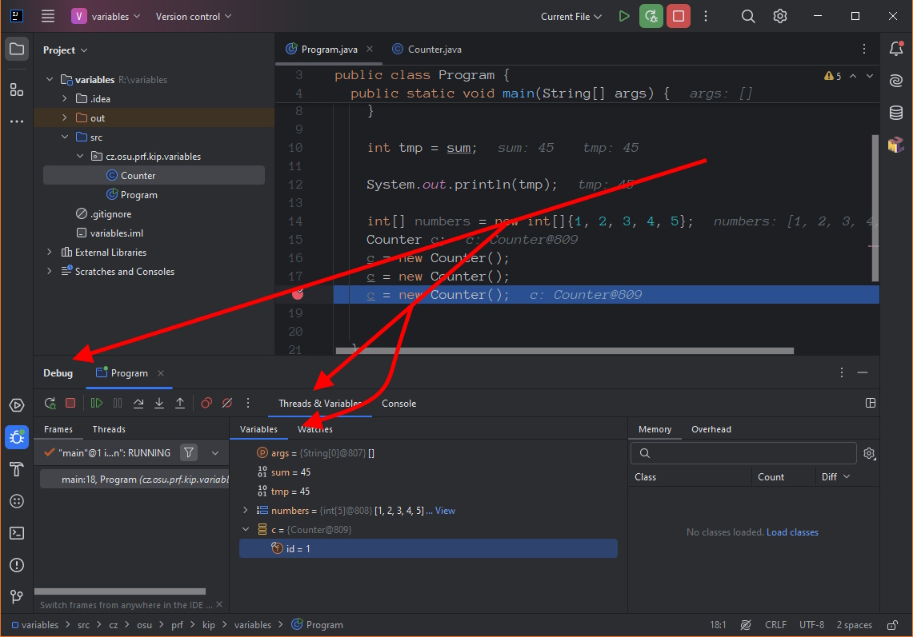
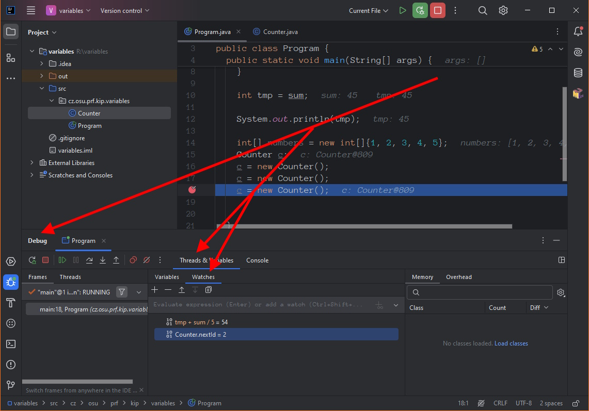

# 7 Monitoring Variables

_Stepping_ is an important technique, but it would be greatly impaired if it did not allow monitoring the values ​​of variables and their changes during the execution of individual steps.

Thus, variable monitoring is a technique that allows you to monitor the values ​​of variables while the program is suspended. It is important to note that **values ​​can only be monitored when the program is suspended**, in _Stepping_ mode. All the following procedures and instructions will work only and only if the application is suspended in step mode. Variable values ​​are not displayed when the application is running.

Note that everytime you are checking for variable value, the two following conditions must be met:

* the variable is valid in the current context, and
* the program must be in the suspended (stepping) state.

The _current context_ means that the variable is valid and has value with the respect to the currently executed line. Main examples:

* Declared variables does not have value. Therefore, you cannot check for variable value if it has been only declared, like: `int val;`fasf
* Variables, that **will** be declared in the currently processed block. If the program did not run through the variable declaration (and initalization), it obviously cannot see its value.
* Variables declared in the nested blocks. Variables declared in the nested blocks are only valid inside that block. If you step out of that block, the variable is no longer valid and its (last) value cannot be checked. For example, if you have passed the `for` cycle, you cannot check for the value of the controlling variable.

Final note at the end of the introduction. Variable value is evaluated (and displayed valus are updated) when the program is suspended, or when any code progress step is applied.

## Basic Monitoring Approaches

There are several ways how you can see the current variable value.

**Direct view**

Directly, in IDEa, you can see the variable value in two ways:

* When you place a mouse cursor over the variable name - the pop up window will appear. You don't have to use the currently executing command onl, the IDE can display the value of any variable anywhere in the currently executing code, which is valid in the current context.
* When you step through the statement(s), the IDE will display the relevant variable values on the right side of the statement.


Again, the important thing here is the _current context_. You cannot see the value of the variable outside of it.




In the previous image you can see that the value of variable `tmp` is 45 (the cursor is over the `tmp` name, therefore the popup appeared). Also, you can see on the right side of the command, that the `sum` variable value is also 45. You cannot see the current value of variable `i` as it is no longer valid in the current context.



Similarly, for classes, you can see the info about the class type and an id of the instance. You can expand the info to see the instance content. As above, `c` is a variable containing an instance of `Counter` class with id `809`, this instance as one instance variable `id` with value `1`.


Aforementioned _id of the instance_ is a numerical value presented to provide you the ability to distinguish between different instances of the same class. Having `a=Counter@5`, `b=Counter@6` and `c=Counter@5`, you see you have two instances, where `a<>b` and `a==c`.

However, this value is randomly assigned by a compiler on every run.




Similarly for lists and arrays (or collections, in general), you can see the size of the list/array and expand the window to see the specific elements.

**Variables Window**

The other option is the **Variables** window, which display the values of all the variables known in the current context. If a new variable is delared, it is automatically displayed in this window. Similarly, if the variable is released, it disapears from the Variables window.

The window is available **only** in the Debug mode, via Debug -> Threads & Variables -> Variables.&#x20;


The Debug Window is automatically displayed in the debug mode. However, if closed, it can be acessed via the main menu: View -> Tool Windows -> Variables.




Again, you can see the values directly; for complex variable values (collections, classes) you can expand the list to see more details.

**Watches Window**

The **Watches** window gives you ability to check for the value of any **expression**. The difference is that you can not only check for variables, but also more complex expressions to see the current result.

In this window, you have to add and remove the required expressions - _watches_ - manually.



In the image above, you can see two watches:

* The value of `tmp + sum / 2` is 54.
* The value of `Counter.nextId` is 2 - note that this value is not visible in the variables window as `nextId` is a private static variable of thej `Counter` class.

## Variables Window in Detail

In addition to the previously mentioned features, the other interesting properites are available. To get to those properties, you have to open a context menu over a selected variable. Note not all the options are available for all the variables/views.

### **Object marking**

Using `Mark object` menu item, you can add a custom label to a specific object. Then, you can see this label everywhere this specific object instance is mentioned. This feature allows you to keep track of a specific object in memory throughout your debugging session. This is particularly useful when you want to monitor the state of an object over time or across different points in your code execution. This feature is available only for objects/instances.


For more info, see [https://www.jetbrains.com/help/rider/Setting\_Labels\_to\_Variables\_Objects\_and\_Watches.html](https://www.jetbrains.com/help/rider/Setting\_Labels\_to\_Variables\_Objects\_and\_Watches.html).


### **Set value**

For primitive types and string, you can use this option to change the value of the variable anytime. Note this is available only in the Variables, not the Watches window.

### **Add to watches**

Used to easily add the currently selected variable in the Watches window.

### **Show referring objects**

This feature helps you understand memory usage and object references. When you use this feature, it displays all objects that hold a reference to the selected object in memory. This is particularly useful for identifying memory leaks or understanding the lifecycle of objects during debugging.

### **Show xxx objects**

This feature is able to show you the objects of the same type as the selected one. The title of the menu item is reflecting the currently selected variable, e.g. "Show Person objects" or "Show Integer objects".

### **Toggle Field Watchpoint**

This is a very interesting feature working as a **breakpoint** hit when the class field value changes. So, the program is automatically suspended whenever the field value changes. Note this option is only available for the fields of the classes.

## Watches Window in Detail

As mentioned, in Watches window you have to add expressions on your own. You can add a watched expression - a _watch_ - by pressing `+` key and remove the selection by `-` key.

As a watch, you can add any expression, that can produce the value. It may be a single variable name, or an arithmetic/relation expression, a function call evaluation or any combination. Examples:

* `x`
* `x + y * 6`&#x20;
* `a > b || b > c && (d || !e)`&#x20;
* `c.getAge()`
* `new Person().getAge()`
* `(5 + 4) + c.getAge()`
* `Math.random()`
* `Math.sqrt(Math.pow(a, 2) + Math.pow(b, 2))`

Note that the expressions are evaluated after every step. For example, if you put `Math.random()` in the watch, you will se a new randomly generated number after every step in the code.

### **Direct expression value check**

In the Watches window, to quickly check the value expression, you can write it into the first line text field. The value will be directly evaluated and the result will be shown (on Enter key), but the expression will not be put among other watches.

To put the expression among watches, use Ctrl+Shift+Enter.

### **Side effect expressions**


Read the following section carefully as it may significantly affect your debugging results!


Note that every evaluation of the watches invokes the respective function calls with appropraite affects on the code.


For the following example, you must have the Watches window visible at the all time.


Imagine the following code:

```java
public class Program {
  private static int nextId = 0;
  private static int getNextId(){
    return nextId++;
  }

  public static void main(String[] args) {
    int a = getNextId();
    int b = getNextId();
    int c = getNextId();
    
    System.out.println(a +", " + b + ", " + c);
  }
}
```

If you place a breakpoint at the first line in the `main()` and go throught the app via _step-over_s, you will get:

```
0, 1, 2
```

However, if you add a new watch expression `getNextId()` and go through the code by _step-over_s, you will get:

```
1, 3, 5
```

If you do the same with _step-into_s, you will get:

```
2, 6, 10
```

Similarly, if you duplicate the `getNextId()` watch, the results will be different.

The cause is that the watch `getNextId()` is evaluated after every step. However, to evaluate the expression, the function `getNextId()` must be invoked. Every time the function is invoked, it changes the value of `nextId` variable by `++` operation. Therefore, every step of the code affects the internal variable state.

The primary task of the function is to return the value. If the function changes the state of the program, it also "does the operation of changing the state" - such functions are called **side-effect functions.**

So the conclusion: You should not use the side-effect functions in the watches. If so, be aware of the potentionally unexpected behavior and unappropriate results.

## Final remarks

The variables/watches states are not stored in the source codes, but in a separate project folder (`.idea`). If you transfer your project to another computer, without those data, all the settings will be lost.


