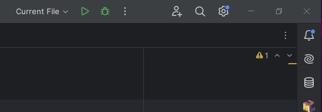
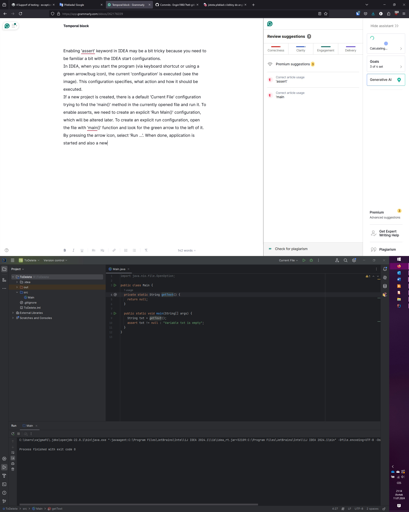
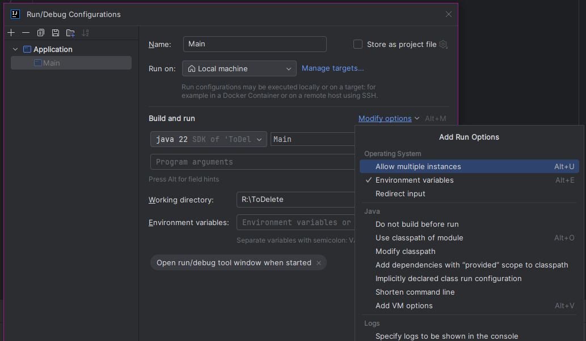
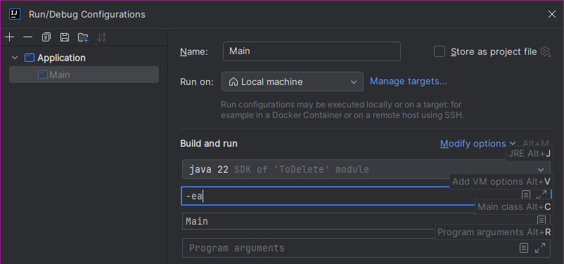

# 4.1 assert Keyword

## _assert_ keyword

The `assert` keyword is one of the simple variants that can be used to replace the previous technique of monitoring continuous statements. Java allows you to write this keyword anywhere in the code and use it to test a condition that must be true in that part of the code. If the condition is not true, the execution of the applications stops and `AssertError` is raised.

The basic notations of the assert command are:

```
assert <condition>;
assert <condition> : "Message";
```

The "condition" is an expression that returns true/false. If the value of the expression is false, the program execution is terminated and an error is raised - either a general text (in the case of using the first-line variant without its own error message), or a custom message text (in the case of using the second-line variant with its custom error message).


The keyword `assert` works only if assertions are enabled in the Java Virtual Machine. See the paragraph below.


Attention! In order for assert statements to work, Java Virtual Machines must be notified to take them into account. This is done using the –ea switch in the virtual machine parameters. In the NetBeans environment, this can be done by calling up the context menu above the project and choosing Properties.

#### Creating a Main configuration

In IDEA, enabling 'assert' keyword may be a bit tricky because you need to be familiar a bit with the IDEA _run configurations_.



In IDEA, when you start the program (via keyboard shortcut or using a green arrow/bug icon), the current so-called configuration is executed (see the image above). This configuration specifies an action, which should be executed. If a new project is created, there is a default 'Current File' configuration trying to find the `main()` method in the currently opened file and run it. To enable asserts, we need to create an explicit 'Run Main()' configuration, which will be altered later.



To create an explicit run configuration, open the file with `main()` method and look for the green arrow to the left of it. By pressing the arrow icon, select "Run ...". When done, the application starts, and a new 'Main' configuration is created - see the change in the configuration window.

#### Enabling asserts

Once the "Main" configuration is available, open the dropdown menu and select "Edit configurations". Check for the "VM Options" text field in th eopened window. If the field is not visible, select "Modify options" and from the list, select "Add VM Options." Now, the field should be visible.





In the "VM Options" text field enter the value "-ea". This tells Java Virtual Machine to process the asserts.


If we want to ignore assert commands in the application, just delete the switch `-ea` again.


#### Usage of the _assert_ keyword

The assert command means: if the condition is not met, stop the application and throw an error with the message. For the sake of interest - an error means the raising of an `AssertionError` exception, so the exception can be caught using the `try-catch-finally` block.

However, Assert statements are not meant to be used for common state checking and raising. As the asserting behavior is typically disabled in production, it is used mainly during development to check for unexpected behavior or situations. For example, you may check if the variable value is valid after some processing, or validate input parameters in the private methods.


Don't use assert statements to validate values of public parameters. As asserts can be disabled, the checks will not be applied and you may miss an important validation during the execution.


Following example shows a method calculationg a sum of an array:

```java
private static double sumArray(double [] data){
  double ret = 0;
  
  for (int i = 0; i < data.length; i++) {
    ret += data[i];
  }  
  return ret;
} 
```

This function takes an array of data on input, sums it, and returns the sum. However, it does not address at all what happens when a null parameter is passed. The programmer can assume that this will not happen in a "production" application deployed, but must check this at the time of testing, because someone else using this method might miss and pass such a parameter. So the programmer adds a simple condition to the function program:

```java
private static double sumArray(double [] data){
  
  assert (data != null) : "Parameter \"data\" is null.";
  
  double ret = 0;  
  for (int i = 0; i < data.length; i++) {
    ret += data[i];
  }  
  return ret;
} 
```

If asserts are enabled and someone calls the method incorrectly:

```java
double[] data = null;

double sum = sumArray(data);
System.out.println("Součet je " + sum); 
```

The output will be:

```
Exception in thread "main" java.lang.AssertionError: Parameter "data" is null.
	at Main.sumArray(Main.java:14)
	at Main.main(Main.java:9)

Process finished with exit code 1
```

So the basic principle is simple.

Similarly, we can check whether the function works correctly. We create an array with data, run the adding function and compare the result at the end of the run using an assertion.

```java
double[] data = new double[]{1.3, 1.7, -1.5, 2};
double sum = sumArray(data);

assert  
        sum == 3.5 : 
        "Expected value is 3.5, function result is " + sum;
```

Using this feature, it is easy to create a simple test validating the result.
