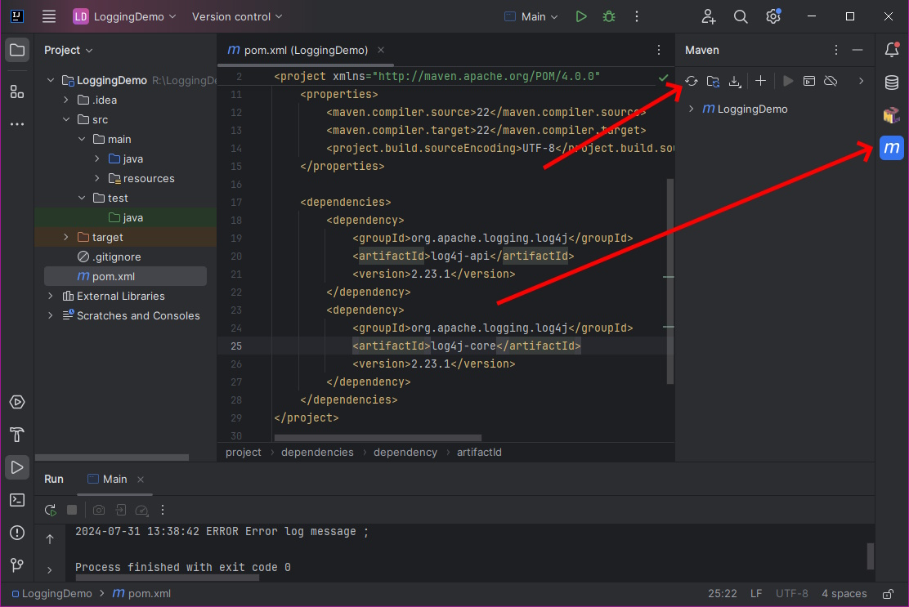
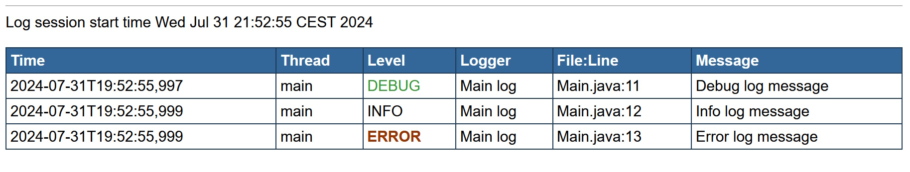

# 3 Logging

A higher level of continuous listings used for debugging is constant monitoring of the application state. In this case, we do not add some additional outputs when trying to find a bug. Instead, during the application development, we are adding the output checkpoints reporting the current state and ensuring, that everything is ok.&#x20;

This technique is called **logging**.

In logging, we record events, messages, or other information to track the operation and performance of the applications. This practice is widely used in various fields, including software development, system administration, and cybersecurity, to help monitor, troubleshoot, and analyze the behavior and performance of systems.

Before we show some simple examples, let's clear out the basic terms:

* Logger - it is an object responsible for obtaining logged messages and their forwarding to the handlers. The instance of the logger is typically the only object a programmer is using directly by invoking and passing logged messages.
* Handler / Appender - is an object delivering the log message to its destination. This destination is typically a console output, file, database, or web service.
* Formatter/Layout - is an object responsible for formatting the log message into the target format processed by a handler.
* Filter - is an object responsible for filtering the appropriate messages (typically by log level, invoker, or target). Commonly, they are used together with handlers to process a specific message with a specific handler only.

There are several logging frameworks available in Java. The most well-known are Log4J2 (do not confuse with Log4J in version 1), Logback, Java-Util-Logging) and others. Moreover, as logging is a critical component, it is commonly divided into two parts:

* a common interface providing basic logging capabilities
* an underlying implementation doing the physical operations.

For interface, SFL4J2 or Log4J-api are commonly used ensuring the basic operations available. To those, many common logging implementations are connectible using appropriate references.

In our case, we will show Log4J2-based solution.


We will show only basic concepts of Log4J2 here. For full documentation, visit [https://logging.apache.org/log4j/2.x/manual/](https://logging.apache.org/log4j/2.x/manual/).


## Minimal working example

To set up the project in Idea for logging, a several steps have to be done:

1. Add the reference to a logging API and a logging framework.
2. Configure the logging.
3. Add the log messages in the code.

### Adding the references

Firstly, you have to add a reference to a logging API and framework. You can add a reference directly into the code (by adding and linking the appropriate .jar files). However, a more common way nowadays is the usage of some tool responsible for references, like _Maven_ or _Gradle_. In our case, we will use _Maven_.&#x20;

Firstly, create a new project. Ensure, you have checked _Maven_ as a build system in the _New project_ dialog. When confirmed, a new project with a Maven configuration file `pom.xml` will be created.&#x20;

Open the file and add the dependencies section with the dependencies for Log4J2 as follows:

```xml
<project>
    ...

    <dependencies>
        <dependency>
            <groupId>org.apache.logging.log4j</groupId>
            <artifactId>log4j-api</artifactId>
            <version>2.23.1</version>
        </dependency>
        <dependency>
            <groupId>org.apache.logging.log4j</groupId>
            <artifactId>log4j-core</artifactId>
            <version>2.23.1</version>
        </dependency>
    </dependencies>
</project>
```

Then, open the Maven sidebar and refresh the project




Note the version line in lines added to `pom.xml`. The version number should be adjusted to the most recent one.


Once the refresh is done, the project contains valid references to the required libraries.

### Setting up the configuration file

To set up the logging framework, you typically can use two main approaches:

* set up the environment using a source code,
* set up the environment using a configuration file.

Setting up the environment using the source code is easier, as you simply call some methods with appropriate parameters. The disadvantage of this approach is that the settings are dependent on the compilation. That means if you need to change the logging configuration (like changing the reported log level), you need to recompile the whole source code.

Setting up the configuration file may be more difficult, as you have to read the documentation to find the correct syntax and location of the file. However, you can change the configuration without affecting the original source code and re-run the application with the new logging settings.

The Log4J2 configuration file is in XML format. The file is called `log4j2.xml`.  The file location depends on the project configuration. However, for default Idea & Maven template, the file location is `./src/main/resources/log4j2.xml`.


Note that the file name is `log4j2.xml`, not `log4j.xml`. The file name differs between Log4J v1 and Log4J2.



For more experienced users, there is also the possibility to set up the logging using `.properties` or `.yaml` files. For more detailed info, see [https://logging.apache.org/log4j/2.x/manual/configuration.html#AutomaticConfiguration](https://logging.apache.org/log4j/2.x/manual/configuration.html#AutomaticConfiguration).


Set the content of the file as follows:

```xml
<Configuration name="default" packages="">
    <Appenders>
        <Console name="console" target="SYSTEM_OUT">
            <PatternLayout pattern="%d{yyyy-MM-dd HH:mm:ss} %p %m%n"/>
        </Console>
    </Appenders>
    <Loggers>
        <Root level="info">
            <AppenderRef ref="console"/>
        </Root>
    </Loggers>
</Configuration>
```

In this file, we define:

* Handler/Appender with console output. Appender is named `console`, the output stream is SYSTEM\_OUT stream. The pattern is defined in `PatternLayout` (we will explain this pattern later).
* Logger `root` logging at levels `info` and higher, using the appender `console`.

### Usage of the logger

Now, we can test the logger in the simple `main()` method.

```java
package cz.osu.prf.kip;

import org.apache.logging.log4j.LogManager;  // be sure using the correct package
import org.apache.logging.log4j.Logger;

public class Main {

  // create logger instance
  private static final Logger logger = LogManager.getLogger(Main.class);

  public static void main(String[] args) {
    // do some logging
    logger.debug("Debug log message");
    logger.info("Info log message");
    logger.error("Error log message");
  }
}
```


There are/may be multiple definitions of tne `Logger` or `LogManager` classes in the projects. Be sure you are using the correct package. For Log4J2, use `org.apache.logging.log4j`.


If you run the project in the current configuration, you should see:

```
2024-07-31 16:58:40 INFO Info log message 
2024-07-31 16:58:40 ERROR Error log message 

Process finished with exit code 0
```

You can change the configuration file to lower the logging level:&#x20;

```xml
...
        <Root level="trace">
...
```

The output will change to:

```
2024-07-31 17:00:14 DEBUG Debug log message
2024-07-31 17:00:14 INFO Info log message
2024-07-31 17:00:14 ERROR Error log message

Process finished with exit code 0
```

### How does it differ from continuous listings?

Continuous listing outpus are placed in the code only for debugging purposes. They pollute the code, and are supposed to be deleted once the bug is found.

Logging, on the other side, is placed in the code for the application lifetime. Different log levels ensure that only the appropriate information is visible when neccessary.

## Log Levels

For logging, you can use different levels representing various significance. Simply say, you can use several basic levels:&#x20;

<table><thead><tr><th width="115">Level</th><th>Description</th></tr></thead><tbody><tr><td>TRACE</td><td>For a very low level reporting, used to monitor the flow of the codes and variables. Example: printing the values of variable in the iteration.</td></tr><tr><td>DEBUG</td><td>For a low level reporting, used for debugging and code analysis as a verification everything goes well. Example: printing a value of a variable with suspicous behavior, or for validating a correct variable value during development/debug.</td></tr><tr><td>INFO</td><td>For a standard reports of the progress and/or success messages of operations. Example: reporting that some operation has started, or has been completed succesfully (+ the result).</td></tr><tr><td>WARN</td><td>For reporting an unexpected values or issues not directly causing the issue in the application. Example: reporting that some variable has unexpected/null value and the default value will be used instead.</td></tr><tr><td>ERROR</td><td>For reporting an error in the application. Application typically cannot continue in the requested operation, but can abort it and continue to run different tasks. Example: Failed to save the work to the file. You can continue your work and try it again later, but for now, your work is not safe.</td></tr><tr><td>FATAL</td><td>For reporting fatal error causing the application to quit. It is used to store as much information as possible before the applcation is exited. Example: An object required to complete the operation is null. App cannot continue.</td></tr></tbody></table>

Everytime a programmer sends a log message, she/he must include the log level. On the otherside, every logger/appender/filter has its predefined log level. For simplicity, it can be said that if logger's log level is lower than the message's log level, the message will be processed. E.g., if logger has a level `info`, it will process all info/warn/error/fatal messages, but will ignore trace/debug messages.


The whole domain is a bit more complicated. To see the full info, follow [https://logging.apache.org/log4j/2.x/manual/architecture.html](https://logging.apache.org/log4j/2.x/manual/architecture.html).


## Handlers/Appenders

As mentioned, handlers (_appenders_ in Log4J2) are responsible for delivering the message to the target destination. There are several predefined appenders in the Log4J2, the most important are described

### Console appender

Console appender is responsible for writing the message into the console. It mus contain a layout pattern describing the format of the message.

```xml
<Console name="STDOUT" target="SYSTEM_OUT">
  <PatternLayout pattern="%m%n"/>
</Console>
```

### File appender

File appender is used to write the message into the file. You have to specify the output file and the layout pattern.

```xml
<File name="logFile" fileName="r:/log.txt">
    <PatternLayout>
        <Pattern>%d %p %c{1.} [%t] %m%n</Pattern>
    </PatternLayout>
</File>
```

### Rolling file appender

Similarly to file appender, this appender is used to save the message into the file. Moreover, it checks the content of the output file and add the ability to delete/rewrite old records based on the record age or maximal file size.

```xml
<RollingFile name="rollingLogFile"
             fileName="R:/rollLog.txt"
             filePattern="R:/rollLog-%i.txt">
    <Policies>
        <SizeBasedTriggeringPolicy size="100kB"/>
    </Policies>
    <DefaultRolloverStrategy max="4"/>
    <PatternLayout>
        <Pattern>%d %p %c{1.} [%t] %m%n</Pattern>
    </PatternLayout>
</RollingFile>
```

The example above shows an appender, which creates a file `rollLog.txt`. Once, during logging, the file size exceeds 100 kB, it renames the file as `rollLog-1.txt` and creates a new file `rollLog.txt`. Once the newly created file exceeds 100 kB, it renames `rollLog-1.txt` to `rollLog-2.txt`, the file `rollLog.txt` to `rollLog-1.txt` and creates a new file `rollLog.txt`for writing. Once the file `rollLog-5.txt` should be created, it will be deleted (maximum 4 files with indices will be kept). &#x20;

However, rolling file appender has many other parameters and for further study we suggest to read the documentation (see the link below).

### JPA apender

JPA apender is used to write log messages into relational database using Java Persistence API. The target JPA persistence unit and the target database must be specified at least.

```xml
<JPA name="jpaAppender" 
     persistenceUnitName="jpaPersistenceUnit"
     entityClassName="cz.ou.kip.LogEntity" />
```

If you are not using JPA in the project and need to log into the database, you may use the low lever JDBC Appender.

### Other interesting appenders

The following appenders will not be described in more detail, but may be useful:

* Failover appender - defines a set of appenders. If the first one fails, it tries the second... etc.
* HTTP appender - to send messages over HTTP.
* NoSQL appender - to write into no-sql databases.
* SMTP apender - to send messages via SMTP as an email.


For more info, follow the documentation at [https://logging.apache.org/log4j/2.x/manual/appenders.html](https://logging.apache.org/log4j/2.x/manual/appenders.html).


## Loggers

### Logger definition

Loggers are defined in the configuration file in the `Loggers` element. By default, at least the default `root` logger should be defined:

```xml
<Loggers>
    <Root level="trace">
        <AppenderRef ref="console" />
    </Root>
</Loggers>
```

However, if required, you can add your custom logger settings (referenced by the logger name) with different log level and/or different appender.

```xml
<Loggers>
    <Logger name="cz.osu.WebApi" level="info" />
    <Logger name="cz.osu.Mailer" level="error">
        <AppenderRef ref="file" />
    </Logger>
    <Root level="trace">
        <AppenderRef ref="console" />
    </Root>
</Loggers>
```

Here, we added two new loggers:

* `cz.osu.WebApi` will capture only `info` messages or higher. Moreover, it has no defined appender, therefore the `root`appender will be used instead.
* `cz.osu.Mailer` will capture only `error` and `fatal` log levels. It has also its own custom appender.

Moreover, if we build log names on packages and class names, it works with hierarchy:

```xml
<Loggers>
    <Logger name="cz.osu" level="info" />
    <Logger name="cz.osu.Mailer" level="error">
        <AppenderRef ref="file" />
    </Logger>
    <Root level="trace">
        <AppenderRef ref="console" />
    </Root>
</Loggers>
```

Here, all the classes (or their respective loggers) in `cz.osu` package will match the first logger definition.  Moreover, only the class `cz.osuMailer` will match the second logger.

Note, that all of the loggers will also match the third, `root` logger. Therefore, every log message from `cz.osu.Mailer` will be logged three times. As this is not required, we typically disable a feature called _additivity_ by updating:

```xml
<Loggers>
    <Logger name="cz.osu" level="info" additivity="false" />
    <Logger name="cz.osu.Mailer" level="error" additivity="false">
        <AppenderRef ref="file" />
    </Logger>
    <Root level="trace">
        <AppenderRef ref="console" />
    </Root>
</Loggers>
```

### Logger instantiation

A new logger is created using `LogManager` by calling a method `createLogger()`. You can provide a name for the logger. If no name is provided, a name of the current class will be used.&#x20;


Note that if you defined custom logger in the configuration as mentioned in the previous setction, the logger name must match the name in the configuration file.


Typically, the name of the logger reflects the name of the class, where the logger is created. The idea is that such class is some component responsible for some operation and reporting its progress via the logger.&#x20;

```java
import org.apache.logging.log4j.LogManager;
import org.apache.logging.log4j.Logger;

...

Logger aLogger = LogManager.getLogger(); // creates a logger with the name of the current class
Logger bLogger = LogManager.getLogger("MyCustomLogger"); // creates a logger with the custom name
Logger cLogger = LogManager.getLogger(MyComponent.class); // creates a logger for class "MyComponent"
```

Note: As loggers are typically shared across the component, they are very often  `static` and `final`.


For more info about loggers, see  [https://logging.apache.org/log4j/2.x/manual/usage.html](https://logging.apache.org/log4j/2.x/manual/usage.html).


## Layouts

Layout defines, how the message is written using the handler/appender. They are defined inside the appenders, e.g.:

```xml
<Console name="console" target="SYSTEM_OUT">
         <JsonTemplateLayout eventTemplateUri="classpath:EcsLayout.json"/>
<!--     <HtmlLayout datePattern="ISO8601" timezone="GMT+0"/>-->
<!--     <PatternLayout pattern="%c :: %d{yyyy-MM-dd HH:mm:ss} %p %m%n"/>-->
</Console>
```

In Log4J2, there are several predefined layouts:

* Pattern - to format message by a custom pattern.
* CSV layout - to produce output in CSV format
* HTML layout - to produce output as HTML table
* JSON Template layout - to produce JSON format
* XML layout - to produce XML otput.

For the ilustration, we will introduce only three of them.

### Pattern layout

Pattern layout offers the possibility to create a custom output message based on a defined pattern. Pattern layout is introduced by a `PatternLayout` element with `pattern`attribute:

```xml
<Configuration name="default" packages="">
    <Appenders>
        <Console name="console" target="SYSTEM_OUT">
            <PatternLayout pattern="%c :: %d{yyyy-MM-dd HH:mm:ss} %p %m%n"/>
        </Console>
    </Appenders>
    <Loggers>
        <Root level="trace">
            <AppenderRef ref="console"/>
        </Root>
    </Loggers>
</Configuration>
```

The pattern item consists of leading % sign, format modifier and conversion character. For exact definition see the documentation. However, the most common modifiers are:

| Modifier | Meaning                                  |
| -------- | ---------------------------------------- |
| c        | Loggger name                             |
| d        | Current date                             |
| l        | Location, where the logging occured. \*) |
| F        | File, where the logging occured. \*)     |
| L        | Line, where the logging occured. \*)     |
| M        | Method, where the logging occured. \*)   |
| n        | Line separator.                          |
| p        | Log level.                               |
| tid      | Thread id.                               |
| tn       | Thread name.                             |
| m        | Log message.                             |

If applied on the previous example, we can see that:

* `%c` - prints the logger name,
* `%d{...}` - logs the current time in the specified format,
* %p - prints the log level (info/debug/warning/...),
* %m - prints the log message, and
* %n - prints the new line separator.

The output may look like:

```
Main log :: 2024-07-31 21:46:32 DEBUG Debug log message
Main log :: 2024-07-31 21:46:32 INFO Info log message
Main log :: 2024-07-31 21:46:32 ERROR Error log message
```


For more precise pattern definition, see documentation at [https://logging.apache.org/log4j/2.x/manual/layouts.html#PatternLayout](https://logging.apache.org/log4j/2.x/manual/layouts.html#PatternLayout).


### HTML layout

HTML layout produces the output table with the logged information. It is defined using `HtmlLayout` tag.

```xml
<Configuration name="default" packages="">
    <Appenders>       
        <File name="htmlLogFile" fileName="r:/log.html">
            <HtmlLayout datePattern="ISO8601"
                        timezone="GMT+0"
                        locationInfo="true"/>
        </File>
    </Appenders>
    <Loggers>
        <Root level="trace">
            <AppenderRef ref="htmlLogFile"/>
        </Root>
    </Loggers>
</Configuration>

```

The provided output wil look like:



### JSON layout

JSON layout produces output in the JSON format. It is defined using `JsonTemplateLayout`element.

```xml
<Configuration name="default" packages="">
    <Appenders>
        <File name="jsonLogFile" fileName="r:/jsonLog.json">
            <JsonTemplateLayout eventTemplateUri="classpath:EcsLayout.json"/>
        </File>
    </Appenders>
    <Loggers>
        <Root level="trace">
            <AppenderRef ref="jsonLogFile"/>
        </Root>
    </Loggers>
</Configuration>
```

Moreover, JSON layout requires additional dependency in `pom.xml` maven file:

```xml
<dependency>
    <groupId>org.apache.logging.log4j</groupId>
    <artifactId>log4j-layout-template-json</artifactId>
    <version>2.23.1</version>
</dependency>
```

Then, the output will look like:

```json
{"@timestamp":"2024-07-31T19:57:21.096Z","ecs.version":"1.2.0","log.level":"DEBUG","message":"Debug log message","process.thread.name":"main","log.logger":"Main log"}
{"@timestamp":"2024-07-31T19:57:21.099Z","ecs.version":"1.2.0","log.level":"INFO","message":"Info log message","process.thread.name":"main","log.logger":"Main log"}
{"@timestamp":"2024-07-31T19:57:21.099Z","ecs.version":"1.2.0","log.level":"ERROR","message":"Error log message","process.thread.name":"main","log.logger":"Main log"}
```


For more information about JSON layout, see [https://logging.apache.org/log4j/2.x/manual/json-template-layout.html](https://logging.apache.org/log4j/2.x/manual/json-template-layout.html).


## Filters

Filter is a tool able to select the log messages based on a condition. Filters are defined inside of the appenders. Again, there are several filters implemented. For simplicity, we will introduce only two of them.

### Level-Range filter

This filter allows to specify a custom log-level range to pass. Only messages in the predefined log-level range will pass the filter.

```xml
...
<Console name="Console">
  <LevelRangeFilter minLevel="debug" maxLevel="info"/>
  <PatternLayout pattern="%d %p %c{1.} [%t] %m%n"/>
</Console>
...
```

### Regex filter

This filter is able to check log message and compare it with the regular expressions.&#x20;


Regular expressions is a advanced technique used to compare/work with strings. Its syntax allows easy check if a string contains (or not) a required sequence of characters.

As we do not expect the reader is familiar with the regular expression syntax, we will show only a simple examples here.


```xml
...
<Console name="Console">
  <LevelRangeFilter minLevel="debug" maxLevel="info"/>
  <RegexFilter regex=".* html .*" onMatch="DENY"/>
</Console>
...
```

This filter defines the regex `.* html .*` with the meaning:

* `.*` means sequence of any characters of any length,
* &#x20;`html` means exact substring \[space]-h-t-m-l-\[space].

Therefore, this filter says: if message contains `html` ,  deny the message (`onMatch=DENY`).


Again, for more information about filters, see documentation at [https://logging.apache.org/log4j/2.x/manual/filters.html](https://logging.apache.org/log4j/2.x/manual/filters.html).



